# DD2424 Deep Learning in Data Science

> **Note**: This project was developed as part of the *Deep Learning in Data Science* course (DD2424) at KTH Royal Institute of Technology.
> 
> **Code of Honour**: If there are similar questions or labs or projects in the future, it is the responsibility of KTH students not to copy or modify these codes, or other files because it is against the [KTH EECS Code of Honour](https://www.kth.se/en/eecs/utbildning/hederskodex). The owner of this repository doesn't take any commitment for other's faults.

---

## 📌 Project Overview

This repository contains a progressive series of image classifiers built **entirely from scratch** using NumPy, applied to the **CIFAR-10** dataset. Starting from a single-layer linear network and evolving to a two-layer neural network with advanced optimization, each stage introduces new techniques while preserving mathematical rigor — all gradients are hand-derived and analytically verified.

### Performance Summary

| Model | Architecture | Optimizer | Key Techniques | Test Accuracy |
| :--- | :--- | :--- | :--- | :---: |
| Baseline (Softmax) | Single-layer | SGD | — | 39.30% |
| Bonus 1 (Softmax) | Single-layer | SGD | Full data, Augmentation, Grid Search | 42.02% |
| Bonus 2 (BCE) | Single-layer | SGD | Sigmoid + BCE Loss, Full data, Augmentation | 41.92% |
| Assignment 2 Baseline | Two-layer (m=50) | SGD + CLR | Cyclical LR, Coarse-to-Fine Search | 51.18% |
| Assignment 2 Bonus (CLR) | Two-layer (m=200) | SGD + CLR | Dual Augmentation, Network Scaling | **56.51%** |
| Assignment 2 Bonus (Adam) | Two-layer (m=200) | Adam | Adam Optimizer, Dual Augmentation | 54.18% |

---

## 📁 Code Files Reference

| File | Description |
| :--- | :--- |
| [`image_classifier.py`](image_classifier.py) | **Assignment 1 — Baseline.** Single-layer Softmax classifier. Implements core pipeline: data loading, forward pass, cross-entropy + L2 loss, hand-derived analytical gradients, and mini-batch SGD. Runs 4 experiments with different hyperparameter configurations. |
| [`bonus_image_classifier.py`](bonus_image_classifier.py) | **Assignment 1 — Bonus 1.** Enhanced single-layer Softmax classifier. Adds full dataset utilization (49k training), on-the-fly random horizontal flipping, automated grid search, and optional step decay for learning rate scheduling. |
| [`BCE_image_classifier.py`](BCE_image_classifier.py) | **Assignment 1 — Bonus 2.** Single-layer classifier refactored with Sigmoid activation + Multiple Binary Cross-Entropy (BCE) loss. Key change: gradient scaled by 1/K, requiring a 10x larger learning rate. Also generates confidence histograms for qualitative comparison with Softmax. |
| [`two_layer_image_classifier.py`](two_layer_image_classifier.py) | **Assignment 2 — Core.** Two-layer neural network (input → ReLU hidden → Softmax output). Introduces Cyclical Learning Rates (CLR), coarse-to-fine random search for λ on log-scale, and He initialization (`1/√d`). |
| [`bonus_two_layer_image_classifier.py`](bonus_two_layer_image_classifier.py) | **Assignment 2 — Bonus.** Extended two-layer network with: network scaling (m=200), dual data augmentation (flipping + spatial translation ±3px), Inverted Dropout, and Adam optimizer support. Supports `optimizer='sgd'` and `optimizer='adam'` modes via a unified `MiniBatchGD` interface. |
| [`torch_gradient_computations.py`](torch_gradient_computations.py) | **Utility.** Uses PyTorch's autograd to independently compute gradients for verification against hand-derived analytical gradients (max error ~10⁻⁸). |

---

## 🛠️ Part 1: Basic Framework & Baseline (Exercise 1)

### Implementation Details
The foundational framework (`image_classifier.py`) includes the following core components:
* **Data Pipeline:** Loading CIFAR-10 batches, transforming labels to one-hot encoding, and pre-processing data (zero-mean normalization based strictly on training set statistics).
* **Forward Pass:** Linear transformation ($s = Wx + b$) followed by a Softmax activation function.
* **Cost Function:** Computes the Cross-Entropy Loss combined with an L2 Regularization term to prevent over-fitting.
* **Backward Pass:** Hand-derived analytical gradients for the weight matrix ($W$) and bias vector ($b$). *Note: The analytical gradients were rigorously tested against PyTorch's automatic differentiation, achieving a maximum absolute error at the $10^{-8}$ scale.*
* **Training Loop:** Mini-batch Gradient Descent.

### Baseline Experimental Results
The baseline network was trained on a single batch (10,000 images) for 40 epochs across four different hyperparameter configurations:

| Experiment | L2 Reg ($\lambda$) | Learning Rate ($\eta$) | Batch Size | Final Test Accuracy |
| :--- | :---: | :---: | :---: | :---: |
| **Exp 1** | 0 | 0.1 | 100 | 29.49% |
| **Exp 2** | 0 | 0.001 | 100 | 39.21% |
| **Exp 3** | 0.1 | 0.001 | 100 | **39.30%** |
| **Exp 4** | 1.0 | 0.001 | 100 | 37.55% |

### Analysis & Visualizations

* **The Importance of a Correct Learning Rate ($\eta$):** A high learning rate ($\eta = 0.1$ in Exp 1) caused severe divergence, as seen below. The loss spikes uncontrollably.
  
  **Figure 1: High Learning Rate Divergence (Exp 1)**
  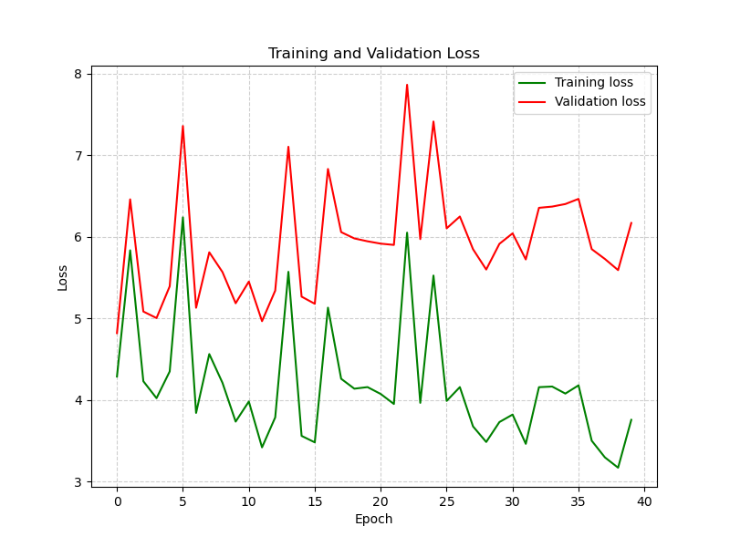

* **Baseline Generalization:** Experiment 3 ($\lambda=0.1$) yielded the best baseline generalization. However, even with mild regularization, a slight gap between validation and training loss begins to appear around epoch 30, suggesting the onset of over-fitting.
  
  **Figure 2: Baseline Best Practice (Exp 3)**
  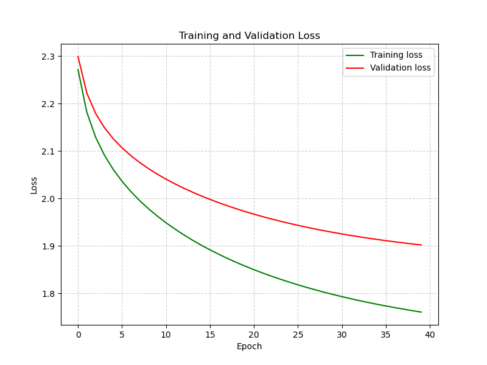

* **Weight Templates:** The visualization of the $W$ matrix (Figure 3) reveals that a single-layer network learns colors and vague contours rather than distinct shapes. You can see a fuzzy horse shape (green torso on green background) and a centered automobile contour.
  
  **Figure 3: Baseline Learnt Weight Templates (Exp 3)**
  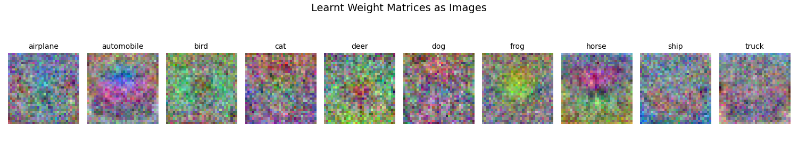

---

## 🚀 Part 2: Performance Improvements (Exercise 2.1 / Bonus 1)

To maximize the performance of a simple linear classifier, several advanced techniques were implemented in `bonus_image_classifier.py`:

### Enhancements Implemented
1.  **Full Dataset Utilization:** Concatenated all 5 CIFAR-10 training batches, utilizing 49,000 images for training and 1,000 for validation.
2.  **Data Augmentation:** Implemented an on-the-fly random horizontal flip with a 50% probability during training to force the network to learn translation-invariant features.
3.  **Automated Grid Search:** Built a grid search mechanism to systematically find the optimal combination of $\lambda$, $\eta$, and batch size.
4.  **Step Decay (Learning Rate):** Explored reducing the learning rate by a factor of 10 every 10 epochs (ultimately disabled for the linear model as it caused premature loss plateauing). 

### Final Results & Analysis
Through Grid Search, the **optimal configuration** was found to be: 
`n_batch = 100`, `eta = 0.001`, and `lam = 0.0`. 

Using this configuration, the network underwent a final deep training phase of 100 epochs, achieving a **final test accuracy of 42.02%**.

**Key Takeaways:**
* **Eradication of Over-fitting:** The combination of Data Augmentation and a massive increase in training data proved incredibly effective. As shown in **Figure 4**, the validation loss flattened and remained entirely stable from epoch 40 to 100 without diverging upwards, proving that over-fitting was completely mitigated.
* **Symmetrical Weight Templates:** Due to the 50% horizontal flipping, the learned weight templates (e.g., "horse" and "automobile") became highly symmetrical (Figure 5). The network successfully learned generalized, centered features rather than memorizing orientation.

  **Figure 4: 100-Epoch Final Loss Curve (Softmax)**
  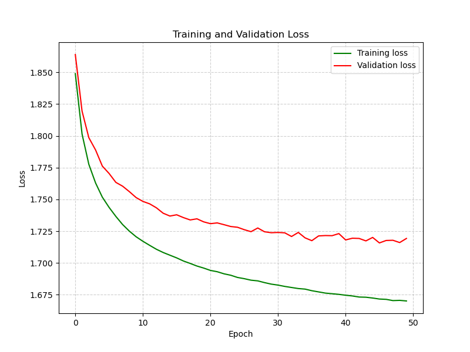

  **Figure 5: 100-Epoch Final Learnt Weight Templates (Softmax)**
  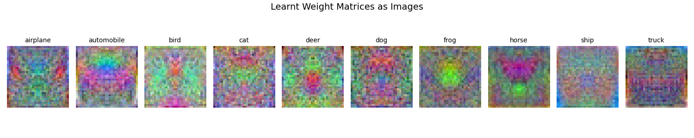

---

## 🧠 Part 3: Multiple Binary Cross-Entropy Loss (Exercise 2.2 / Bonus 2)

To understand the underlying mathematical structure of different loss functions, the network was entirely refactored in `BCE_image_classifier.py` to use a **Sigmoid** activation function paired with a **Multiple Binary Cross-Entropy (BCE)** loss, instead of Softmax and Cross-Entropy.

### Mathematical & Architectural Shift
* **Assumption Change:** While Softmax forces a mutually exclusive probability distribution (single-label), Sigmoid treats the prediction of each of the 10 classes as an independent binary classification problem (multi-label).
* **Analytical Gradient:** The gradient of the Multiple BCE loss with respect to the scores $s$ was hand-derived as $\frac{\partial l}{\partial s} = \frac{1}{K}(p - y)$. This is structurally identical to the Softmax gradient but is scaled down by a factor of $1/K$ (where $K=10$).

### Final Results & Analysis
Because the gradient is scaled down by $1/10$, the network required a proportionally larger learning rate. Grid search identified the **optimal configuration** as:
`n_batch = 100`, `eta = 0.01`, and `lam = 0.001`.

After training for 100 epochs with data augmentation, the model achieved a **final test accuracy of 41.92%**.

**Key Takeaways:**
* **Comparable but Marginally Lower Performance:** The accuracy (41.92%) is highly comparable but very slightly lower than the Softmax counterpart (42.02%). This mathematically aligns with the nature of the CIFAR-10 dataset, where labels are strictly mutually exclusive. Softmax exploits this mutual exclusivity perfectly, while Sigmoid makes a weaker assumption. 
* **Model Capacity Limit:** As seen in Figure 6, the training and validation curves overlap almost perfectly. The lack of a gap confirms zero over-fitting; the model is simply operating at its maximum mathematical capacity for a zero-hidden-layer architecture.

  **Figure 6: 100-Epoch Final Loss Curve (Multiple BCE)**
  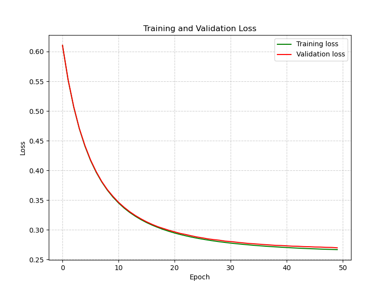

  **Figure 7: Learnt Weight Templates (Multiple BCE)**
  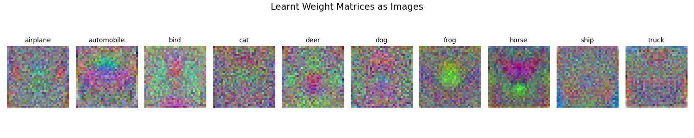

### Confidence Histogram Analysis
To evaluate the qualitative difference in prediction confidence between the two architectures, histograms of the predicted probability for the **ground truth class** were generated for both correctly and incorrectly classified test examples.

**Figure 8: Confidence Distribution (Softmax vs. Multiple BCE)**
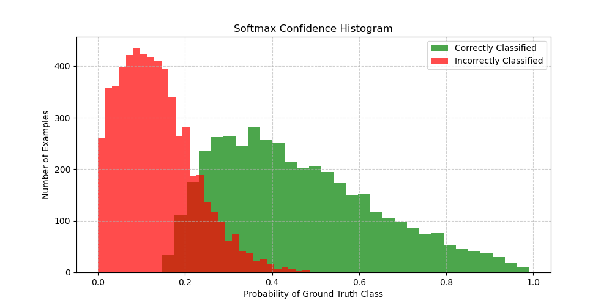
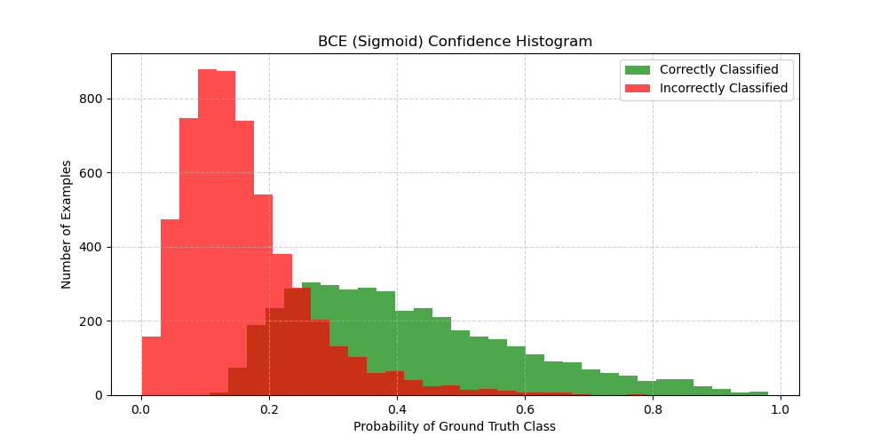

**Qualitative Differences:**
1. **Softmax ("Winner-Takes-All"):** In the Softmax model, probabilities are forced to sum to 1. This creates a highly competitive distribution. Correct predictions (green) frequently reach high absolute probabilities (0.6 to 1.0). Conversely, when the network is incorrect (red), it assigns near-zero probability to the ground truth class because it is highly confident in a wrong class.
2. **Multiple BCE / Sigmoid ("Independent Evaluation"):** The Sigmoid model treats each class independently. Noticeably, the entire distribution shifts significantly to the left. Even for correctly classified examples, the absolute probability assigned to the ground truth class peaks around 0.3 and rarely exceeds 0.6. The network doesn't need to push the absolute value to 1.0; it only needs the ground truth class score to be *relatively* higher than the other 9 independent classes to make a correct prediction.

---

## 🚀 Part 4: Two-Layer Neural Network & Cyclical Learning Rates (Assignment 2)

Building upon the single-layer baseline, the project was expanded to implement a **Two-Layer Neural Network** with a ReLU activation function in the hidden layer. This phase introduced advanced training methodologies, heavily focusing on learning rate scheduling and hyperparameter optimization.

### 1. Architecture & Sanity Check
Before training on the full dataset, the analytical gradients (derived by hand and vectorized in NumPy) were strictly verified. By temporarily disabling L2 regularization ($\lambda = 0$) and training on a micro-batch of 100 images, the network successfully overfitted the data, driving the loss to near zero. This confirmed the mathematical correctness of the backpropagation implementation.

**Figure 9: Sanity Check (Overfitting 100 Images)**
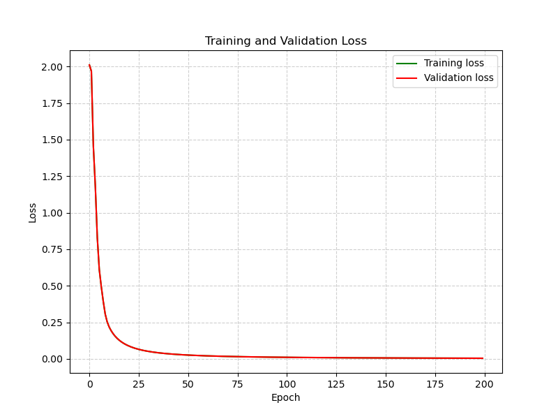

### 2. Cyclical Learning Rates (CLR)
To eliminate the need for exhaustive learning rate tuning and to prevent the network from getting stuck in saddle points or local minima, **Cyclical Learning Rates (CLR)** were implemented. The learning rate oscillates in a triangular schedule between a defined $\eta_{min}$ and $\eta_{max}$.

**Figure 10: Training Metrics over One Cycle vs. Three Cycles**
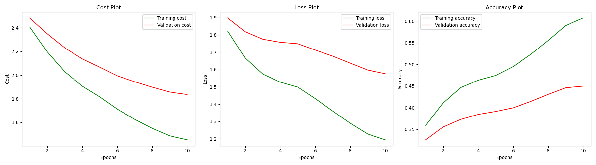
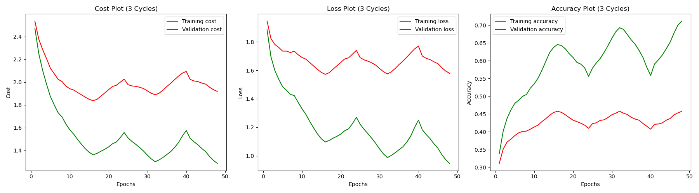
*Observation: The cyclical nature of the learning rate creates distinct "waves" in the cost and accuracy plots. Each cycle allows the network to jump out of suboptimal minima, progressively refining the generalization.*

### 3. Hyperparameter Search & Baseline Final Training
A **Coarse-to-Fine Random Search** was conducted on a logarithmic scale to find the optimal L2 regularization penalty ($\lambda$). 
* **Baseline Configuration:** Hidden nodes $m=50$, trained for 3 full cycles.
* **Optimal $\lambda$:** $\approx 0.000094$
* **Result:** The baseline two-layer network achieved a final test accuracy of **51.18%**.

**Figure 11: Final Baseline Training (m=50)**
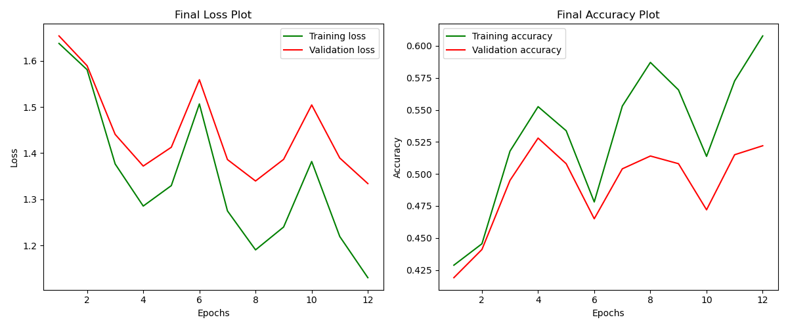

---

## 🏆 Part 5: Advanced Optimizations & Network Scaling (Bonus)

To push the limits of the two-layer architecture, several advanced techniques were systematically tested and combined.

### 1. Network Expansion & Dual Data Augmentation
The network capacity was significantly increased by quadrupling the hidden nodes from $m=50$ to $m=200$. To prevent this highly parameterized network from overfitting, a robust dual data augmentation strategy was introduced:
* **Random Horizontal Flipping (Mirroring):** Pre-computed pixel-index permutation for efficient vectorized flipping at 50% probability.
* **Random Spatial Translations:** Each image randomly shifted by ($\pm 3$ pixels) in both x and y directions with zero-padding.

**Result:** Training this expanded architecture for 5 cycles yielded a massive performance jump, achieving a final test accuracy of **56.51%** (an absolute improvement of +5.33% over the baseline). The aggressive data augmentation acted as an exceptionally strong regularizer, keeping the validation curves tightly tracking the training curves.

**Figure 12: Expanded Network Training (m=200, 5 Cycles, Augmented)**
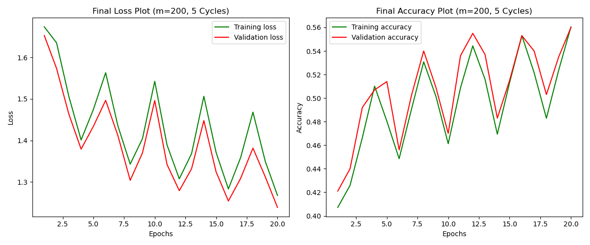

*Note on Dropout:* An experiment was conducted using Inverted Dropout in the hidden layer. However, combining Dropout with aggressive data transformations resulted in **over-regularization** (underfitting) for a network of this capacity.

### 2. Optimizer Showdown: Adam vs. SGD with CLR
As a final experiment, the cyclical learning rate schedule was replaced with the **Adam Optimizer** using a fixed base learning rate ($\eta = 5 \times 10^{-4}$). The Adam optimizer combines the benefits of Momentum and RMSprop with bias-corrected first and second moment estimates.

**Result:** Adam achieved a final test accuracy of **54.18%**. 

**Figure 13: Adam Optimizer Training Curves**
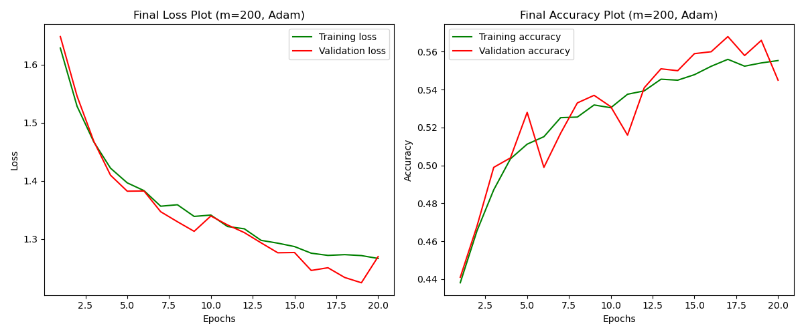

**Key Takeaway (Adam vs. CLR):**
While the Adam optimizer provided remarkably smooth curves and rapid initial convergence, it slightly underperformed compared to SGD with Cyclical Learning Rates (56.51%). This experiment practically highlights a known deep learning phenomenon: the periodic large learning rate spikes in CLR act as a powerful *implicit regularizer*, forcing the network to settle into wider, more robust global minima, whereas Adam can sometimes converge too quickly into sharper local minima.

---

## 🔧 Setup & Reproduction

### Prerequisites
* Python 3.x
* NumPy, Matplotlib, Pickle
* (Optional) PyTorch — only for gradient verification via `torch_gradient_computations.py`

### Dataset
Download the [CIFAR-10 Python version](https://www.cs.toronto.edu/~kriz/cifar.html) and place the extracted `cifar-10-batches-py` folder under `Datasets/`.

```
DD2424_Assignment1/
├── Datasets/
│   └── cifar-10-batches-py/
│       ├── data_batch_1
│       ├── ...
│       └── test_batch
├── images/
│   ├── Assignment2/
│   └── ...
├── image_classifier.py
├── bonus_image_classifier.py
├── BCE_image_classifier.py
├── two_layer_image_classifier.py
├── bonus_two_layer_image_classifier.py
├── torch_gradient_computations.py
└── README.md
```

### Running
```bash
# Assignment 1 — Baseline (4 experiments)
python image_classifier.py

# Assignment 1 — Bonus 1 (Grid Search + Final Training)
python bonus_image_classifier.py

# Assignment 1 — Bonus 2 (BCE Loss)
python BCE_image_classifier.py

# Assignment 2 — Core (CLR + Coarse-to-Fine Search)
python two_layer_image_classifier.py

# Assignment 2 — Bonus (Adam / Augmentation / Scaling)
python bonus_two_layer_image_classifier.py
```